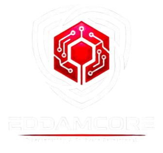

<div align="center">
  
  <h1>EddamCore</h1>
  <p>Cybersecurity & Software Development</p>
</div>

# Sistema de Facturación Electrónica Web 🚀


Aplicación Web moderna y profesional para la emisión de Comprobantes de Pago Electrónicos (CPE), diseñada para cumplir con los estándares de la SUNAT y ofrecer una experiencia de usuario excepcional.

**Desarrollado por:** Eddam_Eloy y el equipo de desarrollo. 👨‍💻

---

## 🌟 Características Principales

### 🔐 Seguridad y Autenticación
*   **Login Seguro:** Autenticación basada en JWT (JSON Web Tokens).
*   **Auto-Logout Inteligente:** Cierre de sesión automático tras 15 minutos de inactividad para proteger la seguridad de los datos.
*   **Protección de Rutas:** Guardias de navegación para restringir el acceso no autorizado.

### 📋 Gestión Comercial
*   **Clientes:** Registro completo de clientes (RUC, DNI), validación de documentos y gestión de directorio.
*   **Productos:** Catálogo de productos y servicios, incluyendo códigos de unidad (NIU, ZZ, etc.) y precios unitarios.

### 🧾 Facturación Electrónica (Core)
*   **Emisión de Facturas:** Interfaz intuitiva para la creación de comprobantes.
    *   Búsqueda inteligente de clientes y productos.
    *   Cálculo automático de IGV (18%) y totales.
    *   Soporte para múltiples monedas (PEN, USD).
*   **Ciclo de Vida del Comprobante (Workflow Visual):**
    1.  **Creada (CREATED):** Generación del borrador.
    2.  **XML Generado:** Botón para generar el archivo UBL estándar.
    3.  **Firmada:** Firma digital del comprobante.
    4.  **Enviada (SENT):** Envío a los servidores de la SUNAT/OSE.
*   **Visualización Detallada:** Vista profesional de la factura ("Ojo") con diseño listo para imprimir, mostrando todos los datos fiscales (Emisor, Cliente, Ítems, Impuestos).

### 🎨 Experiencia de Usuario (UX/UI)
*   **Modo Oscuro:** Soporte nativo para Dark Mode.
*   **Diseño Responsivo:** Adaptable a móviles, tablets y escritorio.
*   **Arquitectura Dinámica:** Configuración de empresa externalizada y adaptable a respuestas del backend.

---

## 🛠️ Stack Tecnológico

*   **Frontend Framework:** React 18 + TypeScript
*   **Build Tool:** Vite (Ultra rápido)
*   **Estilos:** TailwindCSS (Diseño Utility-first)
*   **Navegación:** React Router DOM (SPA)
*   **HTTP Client:** Axios (con interceptores para manejo de tokens)
*   **Iconografía:** Lucide React

---

## 🚀 Instalación y Despliegue

### Requisitos Previos
*   Node.js (v16.0 o superior)
*   NPM o Yarn

### Pasos para Ejecutar en Local

1.  **Clonar el Repositorio**
    ```bash
    git clone https://github.com/deividlima1234/system-factelec-web.git
    cd system-factelec-web
    ```

2.  **Instalar Dependencias**
    ```bash
    npm install
    # o
    yarn install
    ```

3.  **Configurar Variables de Entorno (Opcional)**
    El proyecto utiliza `vite.config.ts` para gestionar el proxy hacia el backend. Por defecto apunta a `localhost:8080`.

4.  **Iniciar Modo Desarrollo**
    ```bash
    npm run dev
    ```
    La aplicación estará disponible en `http://localhost:5173`.

### Conexión con Backend
El sistema espera un Backend RESTful (Spring Boot / Laravel / Node) corriendo en el puerto `8080` (o configurado en el proxy). Asegúrate de que tu backend provea:
*   Auth (JWT)
*   Endpoints para `clients`, `products`, `invoices`.

---

## 📁 Estructura del Proyecto

```
src/
├── components/      # Componentes UI reutilizables (Forms, Buttons, Modals)
├── config/          # Configuraciones globales (Company Info)
├── context/         # Estado global (AuthContext)
├── layouts/         # Plantillas de diseño (Sidebar, Navbar)
├── pages/           # Vistas principales (Invoices, Clients, Login)
├── services/        # Lógica de comunicación API (Axios services)
├── types/           # Definiciones de Tipos TypeScript (Interfaces DTO)
└── utils/           # Funciones auxiliares
```

---

## 🤝 Contribución

Este proyecto es mantenido por **Eddam_Eloy**. Las contribuciones son bienvenidas bajo el flujo de Pull Requests.

---

© 2025 EddamCore. Todos los derechos reservados.
